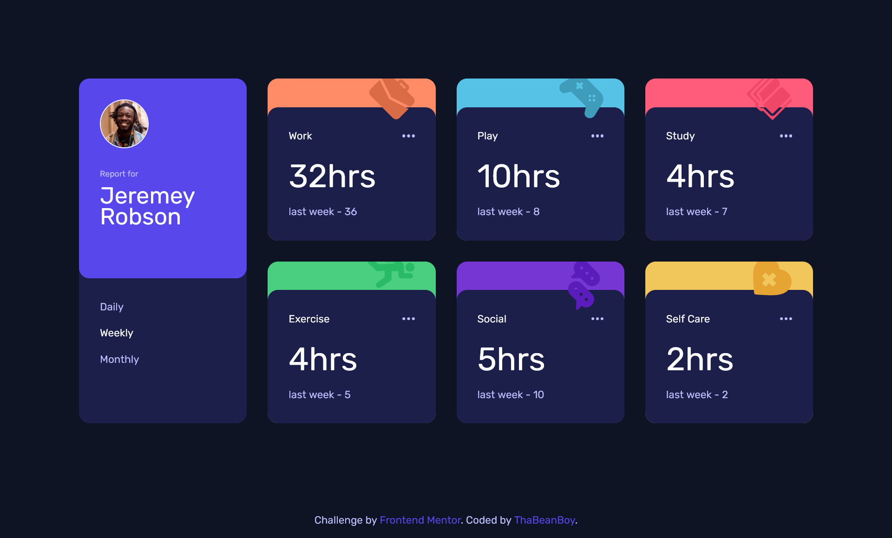
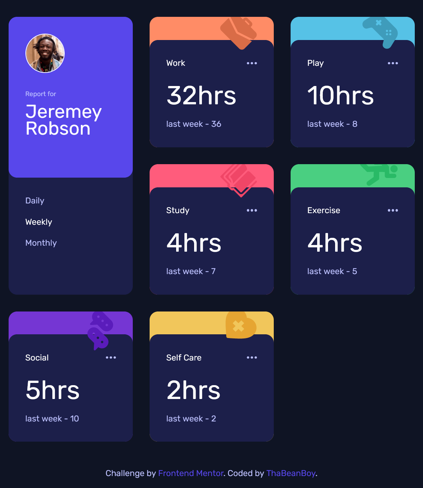
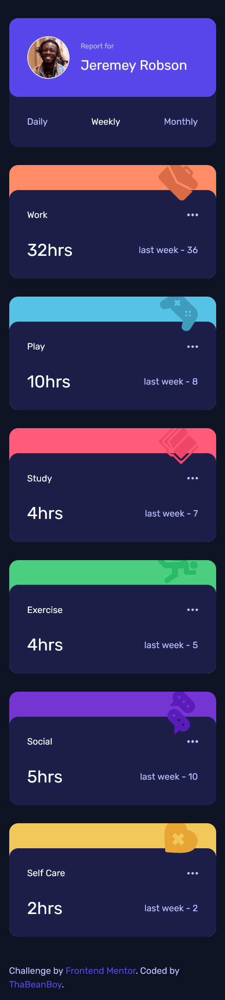
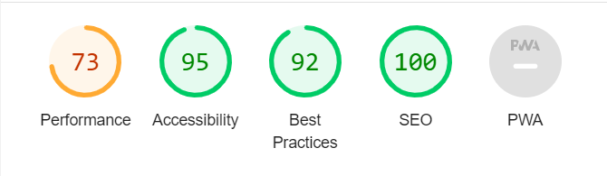
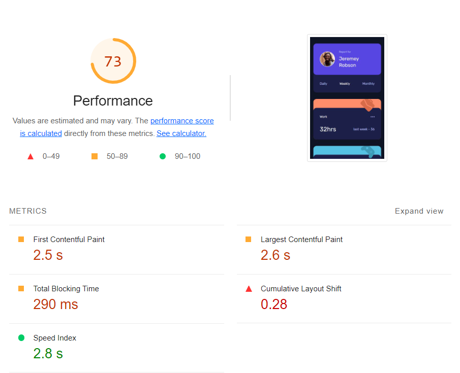

# Frontend Mentor - Time tracking dashboard solution

This is a solution to the [Time tracking dashboard challenge on Frontend Mentor](https://www.frontendmentor.io/challenges/time-tracking-dashboard-UIQ7167Jw).


## Table of contents

- [Frontend Mentor - Time tracking dashboard solution](#frontend-mentor---time-tracking-dashboard-solution)
  - [Table of contents](#table-of-contents)
  - [Overview](#overview)
    - [The challenge](#the-challenge)
    - [Screenshot](#screenshot)
    - [Links](#links)
  - [My process](#my-process)
    - [Built with](#built-with)
    - [What I learned](#what-i-learned)
      - [Learning Astro](#learning-astro)
      - [Layout \& Pages](#layout--pages)
      - [Installing astro packages](#installing-astro-packages)
      - [Using Js Frameworks \& Libraries](#using-js-frameworks--libraries)
      - [Sharing state between islands](#sharing-state-between-islands)
        - [Making the store](#making-the-store)
        - [Using values from the store](#using-values-from-the-store)
    - [Continued development](#continued-development)
    - [Useful resources](#useful-resources)
  - [Perfomance](#perfomance)
    - [Responsiveness](#responsiveness)
    - [Lighthouse results](#lighthouse-results)
  - [Author](#author)

## Overview

### The challenge

Users should be able to:

- View the optimal layout for the site depending on their device's screen size
- See hover states for all interactive elements on the page
- Switch between viewing Daily, Weekly, and Monthly stats

### Screenshot



### Links

- [GitHub Repo](https://github.com/ThaBeanBoy/Front-End-Mentor-Time-Tracking-Dashboard)
- [Add live site URL here](https://front-end-mentor-time-tracking-dashboard-ten.vercel.app/)

## My process

### Built with

- Semantic HTML5 markup
- Flexbox
- CSS Grid
- Mobile-first workflow
- [Tailwind](https://styled-components.com/) - For styles
- [React](https://react.dev/) - JS library
- [Astro](https://astro.build/) - Static Site Generator
- [Vercel](https://vercel.com/) - Hosting website

### What I learned

#### Learning Astro

Astro is used to build static sites that support multiple javascript frameworks & libraries while shipping little javascript. From my understanding, Astro islands are similar to react components, but this time, islands are converted to static HTML. you can find more information on Astro's islands architecture [here](https://docs.astro.build/en/concepts/islands/)

Unlike other Frameworks & libraries I've worked with in the past, [Astro](https://astro.build/) generates an MPA (Multi-Page Application) instead of an SPA (Single-Page Application). More details on this can be found [here](https://docs.astro.build/en/concepts/mpa-vs-spa/).

You can learn more [here](https://docs.astro.build/en/getting-started/)

#### Layout & Pages

The concept of a layout component & different pages in the pages directory isn't a new thing to me. The only thing I had to learn when making a layout component is that you need to insert a `<slot />` in the layout, this is where the page would put itself in.

My [layout component](./src/layouts/Layout.astro) & my [homepage](./src/pages/index.astro)

**The code below is from the astro docs**

```astro
---
import BaseHead from '../components/BaseHead.astro';
import Footer from '../components/Footer.astro';
const { title } = Astro.props;
---

<html lang='en'>
  <head>
    <meta charset='utf-8' />
    <meta name='viewport' content='width=device-width, initial-scale=1' />
    <BaseHead title={title} />
  </head>
  <body>
    <nav>
      <a href='#'>Home</a>
      <a href='#'>Posts</a>
      <a href='#'>Contact</a>
    </nav>
    <h1>{title}</h1>
    <article>
      <slot />
      <!-- your content is injected here -->
    </article>
    <Footer />
  </body>
</html>
```

```astro
---
import MySiteLayout from '../layouts/MySiteLayout.astro';
---

<MySiteLayout title='Home Page'>
  <p>My page content, wrapped in a layout!</p>
</MySiteLayout>
```

#### Installing astro packages

One of the most enjoyable things about Astro is working with the CLI. This is a simple project, but when installing packages from Astro, I didn't have to touch any config files. This seems small, but it automatically added tailwind, image & react to the [astro config](./astro.config.mjs).

For example, when I wanted to use [Tailwind](https://styled-components.com/), I simply ran the following command in the terminal, `npx astro add tailwind`. I didn't have to manually install tailwind, configure [astro](./astro.config.mjs) etc... 😃

#### Using Js Frameworks & Libraries

In order to use react, I ran the following command:

```terminal
npx astro add react
```

I placed my react components inside the [components directory](./src/components/) & used the `.tsx` file extension.

Importing and using the components was easy, this is how it looks like:

```astro
---
import Buttons from '../components/Buttons';
import DashboardCard from '../components/DashboardCard';
---

<Layout title='Time Tracking Dashboard'>
  <main>
    <Buttons client:load />

    <DashboardCard
      title={title}
      illustration={illustration}
      tframes={timeframes}
      bgColor={bgColor}
      client:idle
    />
  </main>
</Layout>
```

#### Sharing state between islands

##### Making the store

This was the trickiest part for me, but before I explain 'sharing state between islands', we first need to understand why we had to share state between them in the first place.

Making a component, which has its own state is easy, but when the user clicks `Daily`, `Weekly` or `Monthly`, the content of each [Dashboard](./src/components/DashboardCard.tsx) has to update and display the correct information. In order to achieve this, I made use of [Nano Store](https://docs.astro.build/en/core-concepts/sharing-state/).

Using [Nano Store](https://docs.astro.build/en/core-concepts/sharing-state/) reminded me of [Redux](https://redux.js.org/) and [React's](https://react.dev/) [useContext hook](https://react.dev/reference/react/useContext).

The store can be found [here](./src/timeFramesStore.ts), let's go over it line by line:

```ts
import { atom } from 'nanostores';

type timeFrameTypes = 'Daily' | 'Weekly' | 'Monthly';

export const timeFrames: timeFrameTypes[] = ['Daily', 'Weekly', 'Monthly'];

export const activeTimeFrame = atom<timeFrameTypes>('Weekly');
```

`import { atom } from 'nanostores';` - I import `atom` from nanostores. The reason I used atom is because we are going to store a string, nothing complicated.

`type timeFrameTypes = 'Daily' | 'Weekly' | 'Monthly';` - This is typescript, and I wanted to leverage it by restricting the type of value the string would contain, Similar to using an enum. because of this, we know that there can only be 3 different values, & when we set the value, we are only restricted to those 3 values. This is why I love [Typescript](https://www.typescriptlang.org/).

`export const timeFrames: timeFrameTypes[] = ['Daily', 'Weekly', 'Monthly'];` - I wanted to store the 3 different values in an array, this is important for [buttons component](./src/components/Buttons.tsx). I used this array to display the 3 different time frames & assign event listeners to them.

`export const activeTimeFrame = atom<timeFrameTypes>('Weekly');` - Export the store. We also assign the type that the atom store holds by using Generics, (the angle brackets < & >)

##### Using values from the store

**[Buttons](./src/components/Buttons.tsx)**

```astro
import { useStore } from '@nanostores/react';
import { timeFrames, activeTimeFrame } from '../timeFramesStore';

export default function Buttons() {
  return (
    <div
      id='timeframes'
      className='flex w-full items-start justify-between gap-4 p-8 brk:flex-col'
    >
      {timeFrames.map((timeFrame, key) => {
        const $active = useStore(activeTimeFrame);
        const isActive = timeFrame === $active;

        const handleClick = () => activeTimeFrame.set(timeFrame);

        return (
          <button
            className={`${isActive && 'text-white'}`}
            key={key}
            onClick={handleClick}
          >
            {timeFrame}
          </button>
        );
      })}
    </div>
  );
}
```

`import { timeFrames, activeTimeFrame } from '../timeFramesStore';` - activeTimeFrame stores the current value/state. in order to get its value, we place the store inside the useStore method. I remember while reading the docs, it said that you have to prefix the variable name with `$`. This is how we end up with `const $active = useStore(activeTimeFrame);`.

in order to update the state, we use the `.set(/* new state */)` method.

### Continued development

It seems like I will have to learn [client:directives](https://docs.astro.build/en/reference/directives-reference/#client-directives) & other [directives](https://docs.astro.build/en/reference/directives-reference/)

```astro
<Buttons client:load />
```

### Useful resources

- [Astro Docs](https://docs.astro.build/) - This helped me for XYZ reason. I really liked this pattern and will use it going forward.
- [Tailwind Docs](https://tailwindcss.com/docs/) - This is an amazing article which helped me finally understand XYZ. I'd recommend it to anyone still learning this concept.

## Perfomance

### Responsiveness

I initially wanted to use flexbox, but eventually realised that css grid would fit this well. I wanted it to look good on desktop, tablet & mobile devices.





### Lighthouse results





## Author

- GitHub - [@ThaBeanBoy](https://github.com/ThaBeanBoy)
- Frontend Mentor - [@ThaBeanBoy](https://www.frontendmentor.io/profile/ThaBeanBoy)
- LinkedIn - [Tineyi G Chipoyera](https://www.linkedin.com/in/tineyi-g-chipoyera-0948b9193/)
